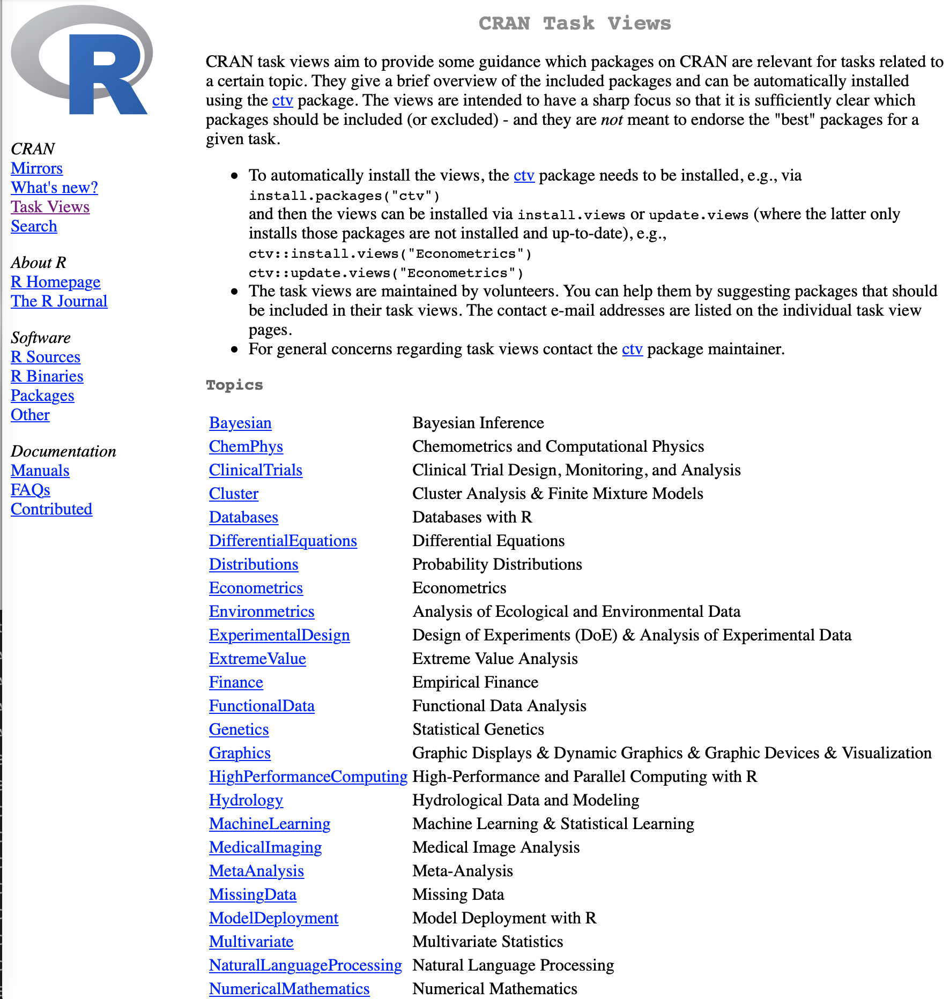

# hw3-stretch

## <span style="color:blue">due by Friday at midnight</span>

Submit:  
1\. Your data (best in .csv format)  
2\. Your script ending in `.R`  
3\. Your output files  

| Criteria           | Evaluation                                                                                             | Scoring |
| ------------------ | ------------------------------------------------------------------------------------------------------ | ------- |
| Runs without Error | Absolutely must be YES                                                                                 | 0/5    |
| Output            | Does code produce evidence of stretch  (trying something new) and contain all components                                                                     | 0-10     |
| Code Readable      | Good use of whitespace,etc                                                                             | 0-5     |
| Understandable     | Concise use of helpful comments - see cars_script.R You are welcome to delete the explanation comments | 0-5     |

Clone the `hw3-stretch` repository into your `Rclass\Homework` directory (please use the invitation link to accept this assignment https://classroom.github.com/a/vQBgv9P0 and then copy the link from your personal repository so that your username is correct):

    git clone https://github.com/Rbootcamp-UHM/....git  

If you run into trouble with git or GitHub, check out the instructions here: <https://github.com/Rbootcamp-UHM/github-classroom-for-students/blob/master/README.md>

## The Idea:

Demonstrate your fabulous new R abilities by trying something new on your **own data or a new-to-you dataset**. You may:
* Use your own data or
* Ask your research advisor for data or
* Or use a built-in dataset or
* Use one of the datasets provided in ClassCodeData or
* Find publicly available data (GenBank, or TreeBase, or Dryad, other data repository, or a website, etc. )

Develop a **new analysis** or **data visualization** or find a **new package** to try on your data.  I donʻt really care what you do, just so long as you stretch yourself. Here are some ideas:
* **Try a New Package** a good place to look for new packages to try are the **Task Views** on http://r-project.org. On the left menu bar click CRAN, choose a mirror, then click on `Task Views`. These are great summaries of all of the packages in an area. -OR-
* **Why did you want to learn R?** Was it to learn how to do graphics? Well then write a script demonstrating all of the possible ways to graph your data. Whatever it was, go for it!! Here is your chance. -OR-
* **Learn how to do an analysis for your work** Do you have a research project that requires a particular kind of analysis? Well, figure it out! -OR-
* **Something else** As long as you demonstrate "stretching" your abilities, go for it!




## Suggested Components

This is an open-ended assignment, so use our judgement as to what to include. Here are some suggestions for making a well-documented and useful script.

1.  **Describe the purpose of the script**. What is new to you and what are you trying to learn? What are you doing? Are you doing basic data exploration? Trying to apply some particular kind of analysis or method? A data visualization (what kind)? Itʻs good to provide an explanation so that you can remind yourself what you were trying to do when you look back at it. Provide a note in the comments.

2. **The Data** Read in your data, and include in comments a brief description of the data. E.g.:
```
## This is a dataset of morphological measurements on 13 species of lizard with 5 variables: SVL, mass, ... etc.
```
3. **Demonstrate your Package** If you are learning a new package, include a few of the examples (for example at the bottom of the help page) with comments to demonstrate and explain what the functions do.  Similarly, if it is a new type of graph, or whatever, it is useful to demonstrate it on something familiar or simple first before trying it on something new (prove that you know how to use it and what it should look like).

4. **Reshape your Data** Are your data in the correct form for the package? If not, reshape your data to get it into the correct input format, and explain in comments what you are doing (and why).

5. **Apply new package/analysis/visualization to your data** Show us what you got! Try it out on your dataset. What kinds of cool things are you finding out?

6. **Reflection** What do you think? Useful? Not? Difficult? Easy? Worth the trouble? Would you use it again?

7. **Have Fun!**

CONGRATULATIONS! You just finished your last homework assignment, and hopefully you learned something fun and interesting.

## Submission

1.  Test and debug your script. As a final check, after saving your script, shut down R completely and then restart and run from source. Does it run without error?

2.  Submit:  
  a. Your data,  
  b. Your script,  
  c. pdfs or any other output files   

3.  As you go along start pushing your work up to your GitHub repo. Push early and push often! When you're done, submit it:

```
    git add -A
    git commit -m "Final Submission"
    git push origin main
```
If you want me to check before the due date, generate an issue on the website for your repository but be sure to tag me @mbutler808 so I get a notification.
